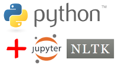

# Software Installation Guide

We need three software components: **Python 3**, **Jupyter Notebook**, and **NLTK**. Two options:

- If you are completely new to Python, you should install Anaconda Python. It includes all three components. ([OPTION 1](#option-1-install-everything-through-anaconda)) 
- If you already have a working copy of Python 3 on your machine, you can install Jupyter Notebook and NLTK separately. ([OPTION 2](#option-2-already-have-python-add-on-components-separately)) 


## Troubleshooting
If you run into problems, please:
- Email the instructors. Note your OS (Windows? Mac?) and give us a description of how and where you are stuck. Screenshots work wonders. 
- On the workshop day, arrive early at 8:30am. The instructors will be ready to get hands-on with your laptop. 


## OPTION 1: Install everything through Anaconda


There are many flavors of Python, but we recommend Anaconda's distribution. Anaconda has the advantage of already including popular scientific libraries such as NLTK. It also includes the Jupyter Notebook interface. (The downside is that it also installs lots of things you might never need.)

### Install
- Go to Anaconda Python's download page: [http://www.anaconda.com/download/](http://www.anaconda.com/download/)

- Make sure you download and install the **Python 3.6 version**. Important!
- 64-bit vs. 32-bit: if your system can handle it (most modern systems can), we recommend 64-bit, which is Anaconda's default choice also. 
- Double-click the downloaded setup file to start the installation process. Details:
   - Ignore the question about installing Visual Studio Code. We don't need it. 
   - A "Get the cheat sheet" dialog box will pop up asking for your email. You can ignore it. 
   - The setup file is 600MB; You will need 3GB of space on your hard drive. 
   - The default settings and options should work fine for most of you.   

### Verify
Depending on your system, Anaconda may take a while to install. Once it finishes, check your installation: 

- Find Anaconda Navigator in your start menu, launch it
- Launch Jupyter Notebook
- Jupyter opens up as a tab in your browser (Safari, Chrome, FireFox, etc.). You should be able to see your personal folders such as `Desktop` and `Documents`. 


## OPTION 2: Already have Python, add on components separately


If you already have a working copy of Python 3 on your machine (perhaps you installed [python.org](https://www.python.org/) version of Python at some point), then you have a choice:

1. Keep your existing Python copy, and install the Anaconda version separately. Both copies of Python will work independently. To go with this option, follow the [Anaconda installation instructions above](#option-1-install-everything-through-anaconda). 

1. Add NLTK and Jupyter Notebook to your existing Python 3. This is a sensible thing to do! Follow instructions below. 

### Install
- Open up a console. For Windows users, it's `cmd` (you might need to choose "Run as administrator" option); for Mac users, it's `Terminal`. ([Screenshot](img/cmd-pip3.png))
- First, make sure your `pip3` is accessible: `where pip3` (Windows), `which pip3` (Mac). It should show pip's installation path.
- If that worked, you can go ahead and install:
	- Install NLTK: `pip3 install nltk`
	- Install Jupyter Notebook: `pip3 install jupyter`
- If `where pip3` fails, then `pip3` is not in your system's path. Try and see if you can find it in places like `C:\Program Files (x86)\Python36-32\Scripts`, `C:\Users\naraehan\AppData\Local\Programs\Python\Python36-32\Scripts`. Once you have successfully located `pip3`, you will have to execute each installation command by fully specifying its path, e.g.,:
	```
	C:\Users\naraehan\AppData\Local\Programs\Python\Python36-32\Scripts\pip3 install nltk
	```


### Verify
Let's check if your installation was successful. 

- Open up a console and type in `jupyter notebook`, followed by ENTER
- Jupyter opens up as a tab in your browser (Safari, Chrome, FireFox, etc.). You should be able to see your personal folders such as `Desktop` and `Documents`. 
- On the right-hand side, click on "New", choose "Python 3".
- Another tab opens up. In the box, type in this line:
	```python
	import nltk
	```
- Then hit the play ▶ button on top. 
- If there is no error, your installation was successful. You can now close the browser window -- no saving necessary. 


