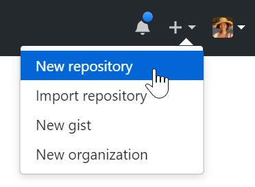

# Linking Git and GitHub

The materials below have been adapted from the excellent lessons by the Software Carpentry, which they have generously made available through the [CC BY 4.0 license](https://creativecommons.org/licenses/by/4.0/). For each of the sections, we encourage you to visit [Software Carpentry's original lesson page](http://swcarpentry.github.io/git-novice/) for more in-depth content. Our workshop lessons below are based on their lessons 7, 8 and 9. 

1. [Remotes in GitHub](#remotes-in-github)
1. [Collaborating](#collaborating)
1. [Conflicts](#conflicts)
1. [Hands-on Group Work](#hands-on-group-work)


## Remotes in GitHub


Version control really comes into its own when we begin to collaborate with
other people. Systems like Git allow us to sync up work between any two repositories.  In
popular use cases, one copy operates as a central hub: most programmers use hosting
services like [GitHub](https://github.com) to hold those master copies. 
Even if you are working by yourself, having a GitHub repository is an excellent backup strategy. 

Let's start by setting up your `languages` project with your own GitHub repository.  Log in to GitHub, then click on the icon in the top right corner to create a new repository:



Name your repository "languages", and then click "Create Repository". As soon as the repository is created, GitHub displays a page with a URL and some information on how to configure your local repository. 

The next step is to connect the two repositories. We do this by making the GitHub repository a **remote** for the local repository. The home page of the repository on GitHub includes its web address. Click on the clipboard icon to copy it:


Then, return to your "languages" directory in command line, and execute `git remote add origin ...`:  

```bash
$ git remote add origin https://github.com/naraehan/languages.git
``` 

Make sure to use the URL for your repository rather than Na-Rae’s: the only difference should be your username instead of `naraehan`. We can check that the command has worked by running `git remote -v`:


```bash
$ git remote -v
origin https://github.com/naraehan/languages.git (push)
origin https://github.com/naraehan/languages.git (fetch)
```

The name `origin` is a typical local nickname for your remote repository. Once it is set up, you are ready to use this command:

```bash
$ git push origin master
```

That "**pushes**" the changes in your local repo out to the GitHub repo, thereby syncing up the two. This "pushing" step is typically the very last step of Git/GitHub workflow, which now looks like:

   1. `git status` (shows clean state)
   1. ... edit some files ... 
   1. `git status`, `git diff`, etc. (to confirm changes)
   1. `git add x y z` 
   1. `git status`, `git diff`, etc. (to confirm changes)
   1. `git commit -m "a message"`
   1. `git push origin master` 

   
It's your time to try: go ahead add another Zulu language fact to `zulu.txt`: it has about 10 million speakers. You should follow the workflow above. 


## Collaborating

Now that I have the repository living online, I can have collaborators.  But what happens when multiple people work on the same repo? Let's find out. First, I will add Brad as a collaborator of my "languages" repo. I go to the GitHub repo, click the settings button on the right, then select Collaborators, and enter Brad's username.


Brad will then get an email message. He can also access the invitation via https://github.com/notifications. Upon accepting it, he will have full access (aka "push" access) to the repo. He then **clones** the repo onto his laptop (more on this later) and goes to work... He adds a new file `japanese.txt`, which he pushes to the GitHub repo.  

That means the GitHub repo is more up-to-date than my own local repo on my laptop! What to do? The key is **pull**. Now that the remote repo can be ahead of my local copy, I need to have `pull` as an important first step of my workflow: 

```bash
$ git pull origin master
remote: Counting objects: 4, done.
remote: Compressing objects: 100% (2/2), done.
remote: Total 3 (delta 0), reused 3 (delta 0)
Unpacking objects: 100% (3/3), done.
From https://github.com/naraehan/languages
 * branch            master     -> FETCH_HEAD
Updating 9272da5..29aba7c
Fast-forward
 japanese.txt | 1 +
 1 file changed, 1 insertion(+)
 create mode 100644 japanese.txt
```

That "**pulls**" the changes in the GitHub repo and merges them onto my local repo. The file `japanese.txt` was entirely new to my local repo, and all Git had to do was copy it over. Now the three repositories (Na-Rae's local, Brad’s local, and Na-Rae’s on GitHub) are back in sync.


<center><table width=80% border=1 bordercolor=cyan style="padding:10px"><tr><td> 
<h3>A Basic Collaborative Workflow</h3>

 When working together, it is a good practice to make sure that you have an updated version of the
 repository: you should get into the habit of using `git pull` before starting work. The basic collaborative workflow therefore would be:

 * update your local repo with `git pull origin master`,
 * make your changes and stage them with `git add`,
 * commit your changes with `git commit -m`, and
 * upload the changes to GitHub with `git push origin master`

In between each step, you should use `git status`, `git diff`, `git show`, `git log`, etc. frequently to verify changes and orient yourself. 
</td></tr></table></center>


## Conflicts


As soon as people can work in parallel, they'll likely step on each other's
toes.  Version control helps us manage these conflicts by giving us tools to
resolve overlapping changes.

Let's see how Brad and I accomplish this.  The file
`zulu.txt` currently looks like this for both of us:

```bash
$ cat zulu.txt
belongs to the Bantu language family
spoken in South Africa
word order: SVO
has about 10 million speakers
```

Brad and I then work on it in conjunction. Brad adds the line "a close relative of Xhosa". I add "one of South Africa's official languages"; after adding and committing, I try to push:

```bash
$ git push origin master
To https://github.com/naraehan/languages.git
 ! [rejected]        master -> master (non-fast-forward)
error: failed to push some refs to 'https://github.com/naraehan/languages.git'
hint: Updates were rejected because the tip of your current branch is behind
hint: its remote counterpart. Merge the remote changes (e.g. 'git pull')
hint: before pushing again.
hint: See the 'Note about fast-forwards' in 'git push --help' for details.
```

What happened? Turns out Brad had pushed his change in the meantime, therefore my local copy is in conflict. An illustration:


Git rejects the push because it detects that the remote repository has new updates that have not been incorporated into my local branch. What I have to do is pull the changes from GitHub, merge them into the copy I'm currently working in, and then push that. So I start by pulling:

```bash
$ git pull origin master
remote: Counting objects: 5, done.
remote: Compressing objects: 100% (2/2), done.
remote: Total 3 (delta 1), reused 3 (delta 1)
Unpacking objects: 100% (3/3), done.
From https://github.com/naraehan/languages
 * branch            master     -> FETCH_HEAD
Auto-merging mars.txt
CONFLICT (content): Merge conflict in zulu.txt
Automatic merge failed; fix conflicts and then commit the result.
```

OK, so that means... `pull` failed? Actually, it only succeeded half-way. `pull` in fact consists of two steps: **fetching** and **merging**, and it failed at the latter step. After the changes from remote branch have been **fetched**, Git detects that changes I made to my local copy overlap with those made to the remote repository, and therefore refuses to **merge** the two versions to stop me from trampling on our previous work. Git then alters the affected file to mark the conflict: 

```bash
$ cat zulu.txt
belongs to the Bantu language family
spoken in South Africa
word order: SVO
has about 10 million speakers
<<<<<<< HEAD
one of South Africa's official languages
=======
a close relative of Xhosa
>>>>>>> dabb4c8c450e8475aee9b14b4383acc99f42af1d
```

My change is preceded by `<<<<<<< HEAD`. Git has then inserted `=======` as a separator between the conflicting changes and marked the end of the content downloaded from GitHub with `>>>>>>>`. (The string of letters and digits after that marker identifies the commit I've just downloaded.)

It is now up to me to edit this file to remove these markers and reconcile the changes. I can do anything I want: keep the change I made in the local repository, keep the change made by Brad in the remote repository, write something new to replace both, or get rid of the change entirely. For our `zulu.txt`, I edit the file to keep both lines, which now looks like:


```bash
$ cat zulu.txt
belongs to the Bantu language family
spoken in South Africa
word order: SVO
has about 10 million speakers
one of South Africa's official languages
a close relative of Xhosa
```

To finish merging, I need to add and then commit the file. First add `zulu.txt` to the changes being made by the merge:

```bash
$ git add zulu.txt
$ git status
On branch master
All conflicts fixed but you are still merging.
  (use "git commit" to conclude merge)

Changes to be committed:

	modified:   mars.txt
```

Then, committing finally completes the local merging process:

```bash
$ git commit -m "Merge changes from GitHub"
[master 2abf2b1] Merge changes from GitHub
```

Am I done? Not remotely (pun intended). My local repository is looking good now, with `zulu.txt` containing both of our new lines. But I still need to push the changes out to the GitHub remote repo via `git push`: 


```bash
$ git push origin master
Counting objects: 10, done.
Delta compression using up to 4 threads.
Compressing objects: 100% (6/6), done.
Writing objects: 100% (6/6), 697 bytes, done.
Total 6 (delta 2), reused 0 (delta 0)
To https://github.com/naraehan/languages.git
   dabb4c8..2abf2b1  master -> master
```

Finally my local repo and the remote GitHub repo are in sync, so the job is done on my end. It is then up to Brad to execute `git pull` on his end, so the three-way syncing process is finally complete. 


Git’s ability to resolve conflicts is very useful, but conflict resolution costs time and effort, and can introduce errors if conflicts are not resolved correctly. If you find yourself resolving a lot of conflicts in a project, consider these technical approaches to reducing them:

* Pull more frequently, especially before starting new work
* Use topic branches to segregate work, merging to master when complete (Note: we did not cover **branches**)
* Make smaller more atomic commits
* Where logically appropriate, break large files into smaller ones so that it is less likely that two authors will alter the same file simultaneously

Conflicts can also be minimized with project management strategies:

* Clarify who is responsible for what areas with your collaborators
* Discuss what order tasks should be carried out in with your collaborators so that tasks expected to change the same lines won’t be worked on simultaneously
* If the conflicts are stylistic churn (e.g. tabs vs. spaces, capitalization), establish a project convention that is governing. 


## Hands-on Group Work 

Time to practice! Let's work together as a group on this GitHub repository: https://github.com/mcdonn/lsa2019-languages-exercise.  


